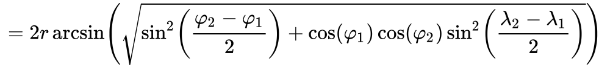

# Assignment 8 (graded): Shortest Paths

*This is a graded assignment. The assignment is due on Tuesday December 18, 2018 at 11pm local
 time. Later github commits will be disgarded.* Please respect the class'
 [policy](https://dsacl3-2018.github.io/policy.html). Happy coding!

## The assignment

In this graded assignment, you will build a route planner that will be capable of calculating the
shortest paths between two given European cities. Unfortunately, you were given some test data from
a third party that you need to clean-up first.

Two input files are provided:

* data_nodes.csv: 1000 vertices where each line of the file defines a node's unique id together with other
  properties. In addition to the node's "Id", you will only need the node's "City" value as well as its
  "Latitude" and "Longitude". Your program can safely ignore the other pieces of information ("Label" and "Attribute1").

* data_edges.csv: approx 14K directed edges between vertices. When reading this file you can ignore the
  edge attributes "Type" and "Weight".

## Ex. 8.1

Looking at the nodes.csv file, you'll notice that there are many duplicates. There are around 50
nodes whose city attribute has value "Berlin". You'll also notice that those 50 entries share the
same geographical coordinates. In the first exercise, you need to clean-up your test data to remove
duplicate node entries so that there is only one entry, for instance, for Berlin.

However, to process the edge file in Ex. 8.2, you cannot just ignore duplicate entries entirely as
you'd miss out many connections, say, between a Berlin duplicate vertex and another destination vertex.

Implement a *Cities* class with the following methods:

~~~java
public class Cities {
    public static Cities readCities(BufferedReader reader) throws IOException

    public String vertexToCity(int vertex) 
    public int cityToPrefVertex(String city) 
    public String vertexIdToCity(String vertex) 
    public Float vertexToLatitude(int vertex) 
    public Float vertexToLongitude(int vertex)
    public int numberCities() 
}
~~~

The removal of duplicate vertices should be done during the *readCities* method.

## Ex. 8.2

Implement a *NavEdgeWeightedDigraph* class with (at least) the following methods:

~~~java
public class NavEdgeWeightedDigraph {
    public NavEdgeWeightedDigraph() throws Exception
    public Cities getNodes()		
    public EdgeWeightedDigraph getGraph()
    private static double getDistance( float lat1, float lon1, float lat2, float lon2 )    
}

~~~

As the name suggests, your class should process the data is such a way that an
an *EdgeWeightedDiGraph* results from your processing.

- Your method for processing the data file for edges will need to consider the hash maps you
constructed in Ex. 8.1.

- To compute the edge weight (remember, you ignore the last column of the edges data input), you take the
  nodes' geographical information into account. Given two pairs of (longitude, latitude), use the
  Haversine formula, see https://en.wikipedia.org/wiki/Haversine_formula to compute the
  distance between two cities:

*Please note that you need to convert longitudes and latitudes given in the data file from degrees to radians.*

*For the radius of the earth, take r = 6371 (in kilometers).*

## Exercise 8.3

Now that you've constructed the navigation graph, write a client code class *TestClient* whose *main* method implements the following
behaviour:

- when called with a single argument, say "Berlin", it computes all shortest paths between the single source "Berlin"
and all other reachable cities;

- when called with two arguments, say "Berlin" and "Liverpool", it computes the shortest path between the source "Berlin" and the target "Liverpool"

In each case, please print out the path(s) and the distances between the individual stops, e.g.

From Berlin to Liverpool (1188.87) go from Berlin -> Hamburg (255.77)  Hamburg -> Amsterdam (364.85)  Amsterdam -> Den Haag (52.76)  Den Haag -> Manchester (465.86)  Manchester -> Liverpool (49.63).

*There are extra bonus points for a proper handling of exceptions.*

## Exercise 8.3 (bonus round)

Convert your edge weighted digraph into its corresponding edge weighted *undirected* graph. Then
compute the graph's minimum spanning tree, and print it. Use your preferred MST algorithm.

## Note:

*Please do not change the given method signatures, say by adding "throws Exception", or by changing
their return type! Changing signatures makes it difficult for the tutors to expose your code to unit tests.
Please define auxiliary methods if you need to.*
